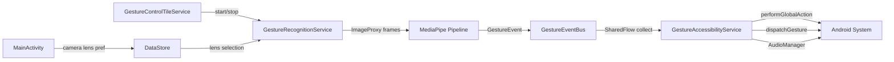

# Android Gesture Control — Design Spec

**Date:** 2026-06-06
**Status:** Approved
**Scope:** Phase 1 — System-wide navigation via hand gestures

---

## Overview

An Android application that lets users control their device through hand gestures recognised by the device camera. Gesture recognition is powered by Google's MediaPipe Tasks SDK. Phase 1 delivers a hardcoded set of navigation and media actions; Phase 2 (separate spec) will add user-configurable gesture mapping.

---

## Constraints & Decisions

| Decision | Choice | Rationale |
|---|---|---|
| Language | Kotlin | Modern Android standard, first-class coroutine/Jetpack support |
| Min SDK | API 26 (Android 8.0) | ~95% device coverage, stable CameraX + MediaPipe support |
| Target SDK | API 34 | Latest stable |
| Architecture | ForegroundService + AccessibilityService | Clean separation of ML pipeline from system interaction |
| Camera API | CameraX (ImageAnalysis) | Lifecycle-aware, abstracts Camera2 complexity |
| ML model | MediaPipe GestureRecognizer | Returns gesture category + landmarks in one pass |
| IPC | Kotlin SharedFlow singleton | Same-process, no deprecated LocalBroadcastManager |
| Settings persistence | Jetpack DataStore | Lightweight, replaces SharedPreferences |
| Camera lens | User-selectable (front/rear) | Configured in MainActivity, persisted via DataStore |

---

## Architecture

### Components

| Component | Type | Responsibility |
|---|---|---|
| `MainActivity` | Activity | Onboarding, accessibility service prompt, camera selection, live status |
| `GestureRecognitionService` | ForegroundService | Owns camera, runs MediaPipe, emits gesture events |
| `GestureAccessibilityService` | AccessibilityService | Receives gesture events, dispatches system actions |
| `GestureControlTileService` | TileService | Quick Settings tile — starts/stops `GestureRecognitionService` |
| `GestureEventBus` | Kotlin object (SharedFlow) | In-process event channel between the two services |

### Data Flow



---

## Camera + MediaPipe Pipeline

Target frame rate: **~15fps** via CameraX `ImageAnalysis` — sufficient for gesture detection while conserving battery.

```
CameraX ImageAnalysis (ImageProxy)
    │
    ▼
MPImageConverter
    │
    ▼
GestureRecognizer (MediaPipe, async live-stream mode)
    │  returns: gesture category + hand landmarks + HandSide
    ▼
┌──────────────────┬─────────────────────────┐
│ StaticGesture    │ DynamicGestureTracker   │
│ Detector         │                         │
│                  │ Ring buffer (~10 frames) │
│ Gesture category │ Wrist landmark velocity  │
│ + dwell timer    │ → swipe direction        │
└────────┬─────────┴────────────┬────────────┘
         └───────────┬──────────┘
                     ▼
             GestureDebouncer
             (per-gesture cooldown: 800ms)
                     ▼
             GestureEventBus.emit(GestureEvent)
```

### Key classes

- **`MPImageConverter`** — converts `ImageProxy` → `MPImage` for MediaPipe input
- **`StaticGestureDetector`** — maps MediaPipe category to `StaticGestureType`; enforces dwell timer (0.8s hold) for gestures that require it
- **`DynamicGestureTracker`** — maintains a 10-frame ring buffer of wrist positions; computes velocity vector; classifies as `SwipeDirection` when displacement exceeds threshold and direction purity > 70%
- **`GestureDebouncer`** — per-gesture-type timestamp map; suppresses re-emission within cooldown window

---

## Event Model

```kotlin
sealed class GestureEvent {
    data class Static(val type: StaticGestureType, val hand: HandSide) : GestureEvent()
    data class Dynamic(val direction: SwipeDirection, val hand: HandSide) : GestureEvent()
}

enum class StaticGestureType { OPEN_PALM, VICTORY, THUMB_UP, THUMB_DOWN, CLOSED_FIST }
enum class SwipeDirection    { LEFT, RIGHT, UP, DOWN }
enum class HandSide          { LEFT, RIGHT }
```

`HandSide` is captured now (MediaPipe provides it for free) to enable hand-specific mappings in Phase 2 without a model change.

---

## Gesture-to-Action Mapping (Phase 1 — hardcoded)

All mappings live in `GestureActionMapper` as a single `when` expression, making Phase 2 replacement with a database-backed mapper straightforward.

### Static gestures

| Gesture | Hold required | Action | API |
|---|---|---|---|
| Open Palm | 0.8s | Home | `GLOBAL_ACTION_HOME` |
| Victory | — | Recent Apps | `GLOBAL_ACTION_RECENTS` |
| Thumb Up | — | Volume Up | `AudioManager.adjustVolume` |
| Thumb Down | — | Volume Down | `AudioManager.adjustVolume` |
| Closed Fist | 0.8s | Notifications shade | `GLOBAL_ACTION_NOTIFICATIONS` |

### Dynamic gestures

| Swipe | Action | API |
|---|---|---|
| Left | Back | `GLOBAL_ACTION_BACK` |
| Right | Quick Settings | `GLOBAL_ACTION_QUICK_SETTINGS` |
| Up | Scroll Up | `dispatchGesture` (upward stroke) |
| Down | Scroll Down | `dispatchGesture` (downward stroke) |

> `GLOBAL_ACTION_LOCK_SCREEN` requires API 28. It is not in Phase 1 but can be added in a single commit without touching the rest of the mapper.

---

## Inter-Service Communication

```kotlin
// GestureEventBus.kt
object GestureEventBus {
    private val _events = MutableSharedFlow<GestureEvent>(extraBufferCapacity = 8)
    val events: SharedFlow<GestureEvent> = _events.asSharedFlow()
    fun emit(event: GestureEvent) { _events.tryEmit(event) }
}
```

- `GestureRecognitionService` calls `GestureEventBus.emit(...)` after the debouncer clears
- `GestureAccessibilityService` collects `GestureEventBus.events` in a coroutine tied to the service lifecycle
- Both services run in the same process — no Binder/AIDL needed

---

## Permissions & Manifest Entries

| Permission / Entry | Reason |
|---|---|
| `CAMERA` | Camera access for gesture recognition |
| `FOREGROUND_SERVICE` | `GestureRecognitionService` |
| `FOREGROUND_SERVICE_CAMERA` (API 34+) | Foreground service camera type |
| `BIND_ACCESSIBILITY_SERVICE` | `GestureAccessibilityService` |
| `BIND_QUICK_SETTINGS_TILE` | `GestureControlTileService` |
| Accessibility service metadata XML | Declares event types, flags, description |

---

## Phased Implementation Plan

| Phase | Name | End State |
|---|---|---|
| 1 | **Project Foundation** | Buildable project, permissions declared, skeleton services, `MainActivity` with accessibility prompt |
| 2 | **Camera Pipeline** | `GestureRecognitionService` running CameraX with selectable lens, foreground notification |
| 3 | **MediaPipe Integration** | `GestureRecognizer` wired to camera frames, detections logged |
| 4 | **Gesture Detection Layer** | `StaticGestureDetector`, `DynamicGestureTracker`, `GestureDebouncer`, `GestureEventBus` all wired |
| 5 | **Action Dispatch** | `GestureActionMapper` + `GestureAccessibilityService` collecting events — app fully functional |
| 6 | **Quick Settings Tile** | Tile starts/stops service, reflects active/inactive state |
| 7 | **Polish & Hardening** | Permission error handling, accessibility-not-enabled flow, frame rate throttling when no hand detected, live status in `MainActivity` |

Phase 5 is the first end-to-end working build. Phases 6–7 layer UX and robustness on top.

---

## Out of Scope (Phase 1)

- User-configurable gesture mapping (Phase 2 spec)
- Custom gesture recording
- Multi-hand simultaneous control
- Gesture feedback (haptic / audio)
- Lock screen gesture control (`GLOBAL_ACTION_LOCK_SCREEN`, API 28+)
